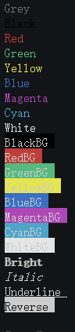

# 描述

- console.log的颜色内容样式自定义

## 更新日志

- 1.0.0 : 重构包, 修改方法的, 降低使用复杂度
- 0.1.0 : 修改DarkGreen的颜色错误, 改为和Green颜色一样, 添加DarkBlue
- 0.0:
  - 0.0.7 修复黑色字体无法正常使用, 添加rLog方法
  - 0.0.6 正常使用的版本, 完善使用文档

<div class="exploded-line" />

## 方法

### `log`

- 单行指定

- `description` : 设置`console`的字体颜色和背景颜色
- `param` `...keys` `Styles[]` 样式
- `returns` : `function(...args) { ...args: 要打印的内容 }`

### `color`

- 当行多次指定

- `description` 指定字段颜色打印
- `param` `source` 待打印信息
- `param` `...keys` `Styles[]`  
- `returns`

eg:`console.log(color('Reverse', 'Reverse', 'Black', 'RedBG'))`

### 使用

```shell
npm install rh-color
```

```ts
import { color, log } from "rh-color";

log('Grey')('Grey')
log('Black')('Black')
log('Red')('Red')
log('Green')('Green')
log('Yellow')('Yellow')
log('Blue')('Blue')
log('Magenta')('Magenta')
log('Cyan')('Cyan')
log('White')('White')
log('BlackBG')('BlackBG')
log('RedBG')('RedBG')
log('GreenBG')('GreenBG')
log('YellowBG')('YellowBG')
log('BlueBG')('BlueBG')
log('MagentaBG')('MagentaBG')
log('CyanBG')('CyanBG')
log('WhiteBG')('WhiteBG')
log('Bright')('Bright')
log('Italic')('Italic')
log('Underline')('Underline')
log('Reverse')('Reverse')
log('Hidden')('Hidden')

// 等同于

console.log(color('Grey', 'Grey'))
console.log(color('Black', 'Black'))
console.log(color('Red', 'Red'))
console.log(color('Green', 'Green'))
console.log(color('Yellow', 'Yellow'))
console.log(color('Blue', 'Blue'))
console.log(color('Magenta', 'Magenta'))
console.log(color('Cyan', 'Cyan'))
console.log(color('White', 'White'))
console.log(color('BlackBG', 'BlackBG'))
console.log(color('RedBG', 'RedBG'))
console.log(color('GreenBG', 'GreenBG'))
console.log(color('YellowBG', 'YellowBG'))
console.log(color('BlueBG', 'BlueBG'))
console.log(color('MagentaBG', 'MagentaBG'))
console.log(color('CyanBG', 'CyanBG'))
console.log(color('WhiteBG', 'WhiteBG'))
console.log(color('Bright', 'Bright'))
console.log(color('Italic', 'Italic'))
console.log(color('Underline', 'Underline'))
console.log(color('Reverse', 'Reverse'))
console.log(color('Hidden', 'Hidden'))
```

#### 打印结果



### 浏览器使用

```html
 <script type="module">
 //  这里next 要指定npm包的版本
  import { color, log } from 'https://cdn.jsdelivr.net/npm/rh-color@next/lib/index.esm.js'
  log(Color.Red)('内容')
  log(Color.Red, Color.Green)('内容')
 </script>
```

## 支持样式

- 样式之间的冲突需要注意

| 颜色 | 代码             | 补充 |
| :--- | :--------------- |:--- |
| 灰色 |`Grey` |
| 黑色 |`Black` |
| 红色 |`Red` |
| 绿色 |`Green` |
| 黄色 |`Yellow` |
| 蓝色|`Blue` |
| 品红 |`Magenta` |
| 青色 |`Cyan` |
| 白色 |`White` |
| 黑色背景 |`BlackBG` |
| 红色背景 |`RedBG` |
| 绿色背景 |`GreenBG` |
| 换色背景 |`YellowBG` |
| 蓝色背景 |`BlueBG` |
| 品红背景 |`MagentaBG` |
| 青色背景|`CyanBG` |
| 白色背景 |`WhiteBG` |
| 样色重置 |`Reset` |
| 明亮 |`Bright` |
| 斜体 |`Italic` |
| 下划线 |`Underline` | 注意中文的使用
| 反装 |`Reverse` | 字体和背景颜色反转
| 隐藏 |`Hidden` |
